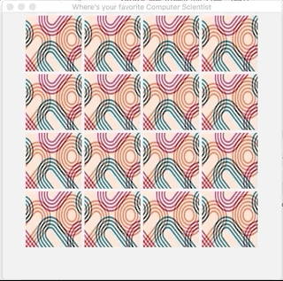

# Project 4 - Memory

## Project Outcomes:
Develop a Java program that uses:
* Graphical User Interface
* Image file input
* Static variables and user-defined classes
* Interfaces and Inheritance

## Preparatory Readings:
ZyBook through chapter 13 (GUI).

## Background Information:
### Project overview:
Memory is a common children's card game wherein a deck of cards are spread out face down on the floor or table.
The deck is made up of pairs of matching images, often things like animals, or colors etc.
Game play proceeds by players taking turns uncovering exactly two cards on a turn.
If they match, the player gets a point and those cards are removed from the table.
If they do not match, the cards are turned back over and the next player takes their turn.

You are free to use whatever image files you prefer.
I have included in this repository image files for eight famous computer scientists.
This would yield 16 cards in gameplay mode since two copies of each image must be used (some versions of the game have two pairs of each image).

### Project Requirements:
Your application must function as described below:
1. Using a graphical display, present a playable version of the memory game.
1. You can use Icons on JButtons, or draw BufferedImages onto a JPanel or JComponent, or use some other means as you see fit.
	1. The important thing is that it works and looks reasonable.
1. Allow a player to interact with the board by clicking on cards with their mouse.
	1. After two cards have been flipped, show them for a couple of seconds before flipping them back over so that players can _learn_ where the images are.
	1. When a match is found, notify the user.
	This can be done via a pop-up alert, or the System console, or some other JComponent in your JFrame, it's up to you.
1. Successive runs of the program must present a different "shuffling" of the deck, this is fairly easy to accomplish using `Math.random` and an ArrayList of image filenames.

#### Sample data
Included are a handful of image files, but you are free to use others if you prefer.
The [image files](images/) are all jpg, with [one](images/back-of-card.png) used to display the cards when they are face down and the others for when a card is face up.

#### Demo
Here is a demo of the gameplay. Note that this is not the only allowable format etc., this is _one_ right answer, not _the_ right answer.

### Implementation Notes:
1. Create a project that is object oriented, therefore there should be several classes.
1. The Java Documentation is your friend.
In this project, you'll certainly need to look over:
	1. Timer (and TimerTask) - for handling the delay on flipping the cards back over.
	1. MouseListener and related classes - for handling the user clicks.
	1. Some image class (BufferedImage, ImageIcon, etc.)
	1. File - for reading the image files.
	1. Other Swing components as needed.

### Submission Requirements:
1. All code must be added and committed to your local git repository.
1. All code must be pushed to the GitHub repository created when you "accepted" the assignment.
	1. After pushing, with `git push origin master`, visit the web URL of your repository to verify that your code is there.
	If you don't see the code there, then we can't see it either.
1. **If your program will not compile, you will receive a zero on this assignment!**
	1. It is better to turn in something that is incomplete but runs than something that is 99% complete but doesn't.
	Treat me like a customer buying a car from you. I'd rather it run but be missing the windows than to look good but not start.

## Important Notes:
* Projects will be graded on whether they correctly solve the problem, and whether they adhere to good programming practices.
* Projects must be received by the time specified on the due date. Projects received after that time will get a grade of zero.
* Please review the academic honesty policy.
	* Note that viewing another student's solution, whether in whole or in part, is considered academic dishonesty.
	* Also note that submitting code obtained through the Internet or other sources, whether in whole or in part, is considered academic dishonesty.
	* All programs submitted will be reviewed for evidence of academic dishonesty, and all violations will be handled accordingly.
